# tikz_graphics
Collection of personal tikz graphics

## Motion Planning

### Probabilistic Roadmap

| Name | Source | Preview | 
|------|--------|---------|
| PRM Step 1 | [prm/prm_1.tex](prm/prm_1.tex) |  | 
| PRM Step 2 | [prm/prm_2.tex](prm/prm_2.tex) | 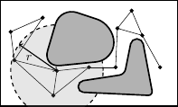 | 
| PRM Step 3 | [prm/prm_3.tex](prm/prm_3.tex) | 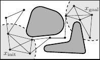 | 
| PRM Step 4 | [prm/prm_4.tex](prm/prm_4.tex) | 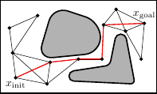 | 

### Fast Marching Tree

| Name | Source | Preview | 
|------|--------|---------|
| FMT Step 1 | [fmt/fmt_1.tex](fmt/fmt_1.tex) | 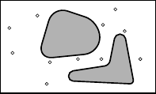 | 
| FMT Step 2 | [fmt/fmt_2.tex](fmt/fmt_2.tex) | 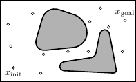 | 
| FMT Step 3 | [fmt/fmt_3.tex](fmt/fmt_3.tex) | 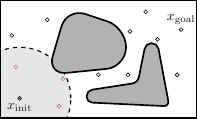 | 
| FMT Step 4 | [fmt/fmt_4.tex](fmt/fmt_4.tex) | 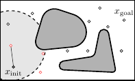 | 
| FMT Step 5 | [fmt/fmt_5.tex](fmt/fmt_5.tex) | 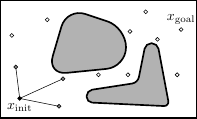 | 
| FMT Step 6 | [fmt/fmt_6.tex](fmt/fmt_6.tex) | 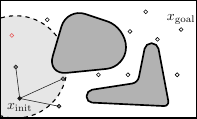 | 
| FMT Step 7 | [fmt/fmt_7.tex](fmt/fmt_7.tex) | 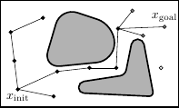 | 
| FMT Step 8 | [fmt/fmt_8.tex](fmt/fmt_8.tex) | 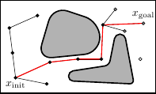 | 

### Lazy State-Lattice Planner

| Name | Source | Preview | 
|------|--------|---------|
|   |   |   |

### Misc

| Name | Source | Preview | 
|------|--------|---------|
|   |   |   |

## Mathematics

### Sampling

### Dispersion

### Discrepancy