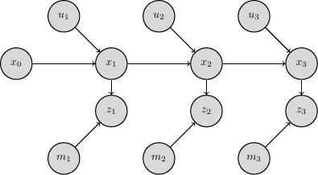
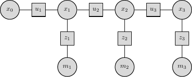
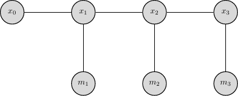
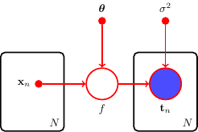
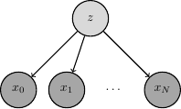
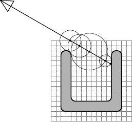

# tikz_graphics
Collection of tikz graphics I made

## Motion Planning

#### Probabilistic Roadmap

#### Fast Marching Tree

#### Lazy State-Lattice Planner

#### Rapidly Exploring Random Trees

### Misc

| Name | Source | Preview | 
|------|--------|---------|
|   |   |   |

## SLAM

| Name | Source | Preview | 
|------|--------|---------|
| Bayesian Network | [slam/bayesian_network_slam.tex](slam/bayesian_network_slam.tex) |  | 
| Factor Graph | [slam/factor_graph_slam.tex](slam/factor_graph_slam.tex) |  | 
| Markov Network | [slam/markov_network_slam.tex](slam/markov_network_slam.tex) |  | 

## Mathematics

### Sampling

### Dispersion

### Discrepancy

## Machine Learning

### Graphical Models
| Name | Source | Preview | 
|------|--------|---------|
| [Bishop](https://www.springer.com/gp/book/9780387310732) Style | [graphical_models/bishop_style.tex](graphical_models/bishop_style.tex) |  | 
| [Koller](https://mitpress.mit.edu/books/probabilistic-graphical-models) Style | [graphical_models/koller_style.tex](graphical_models/koller_style.tex) |  | 

## Computer Graphics
| Name | Source | Preview |
| ---- | ------ | ------- |
| Sphere Tracing | [sphere_tracing.tikz](./differentiable_renderer/sphere_tracing.tex) |  |
